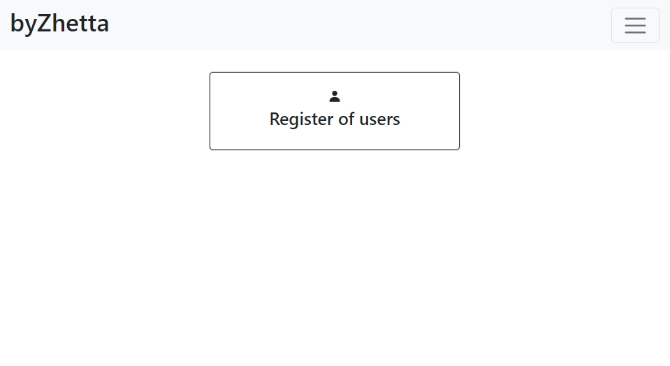
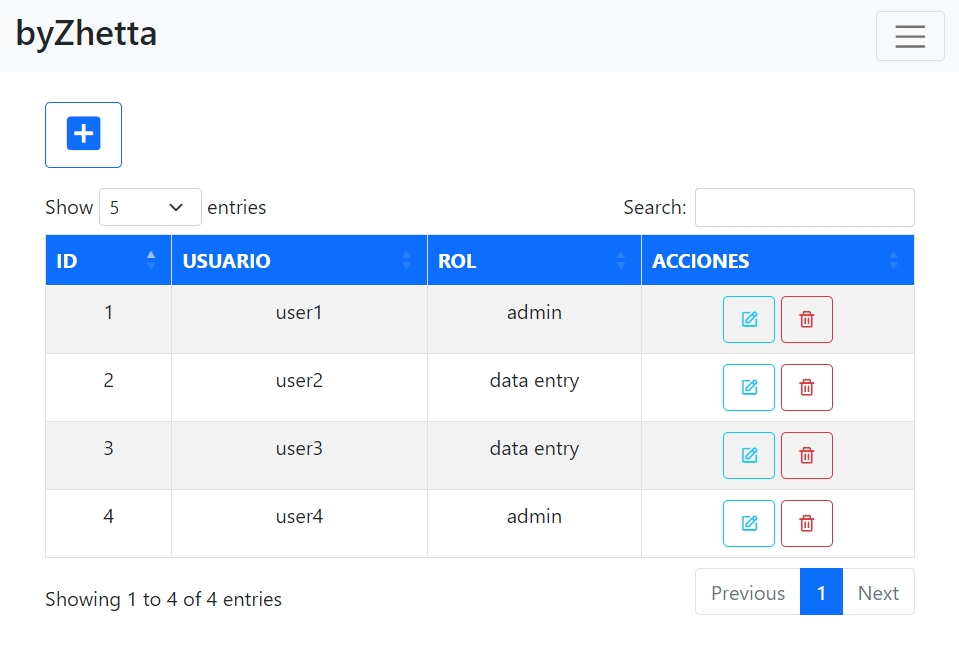

# CRUD de usuarios con Nodejs

Esta aplicación puede hacer operaciones CRUD create-read-update-delete de usuarios, usando las plantilla de EJS.


> Pantalla Home


> Pantalla de usuarios

## Instalación

```
git clone https://github.com/byZhetta/CRUD-Nodejs
cd CRUD-Nodejs
npm install
npm start
```

## Variables de entorno

Esta aplicación necesita las siguientes variables de entorno:

- `HOST` url del servidor
- `USER` tipo de usuario del servidor
- `DB_PASS` contraseña de la base de datos
- `DB_NAME` nombre de la base de datos